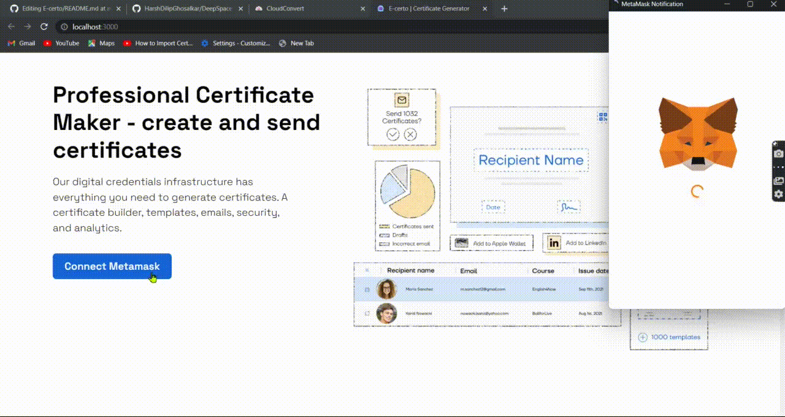
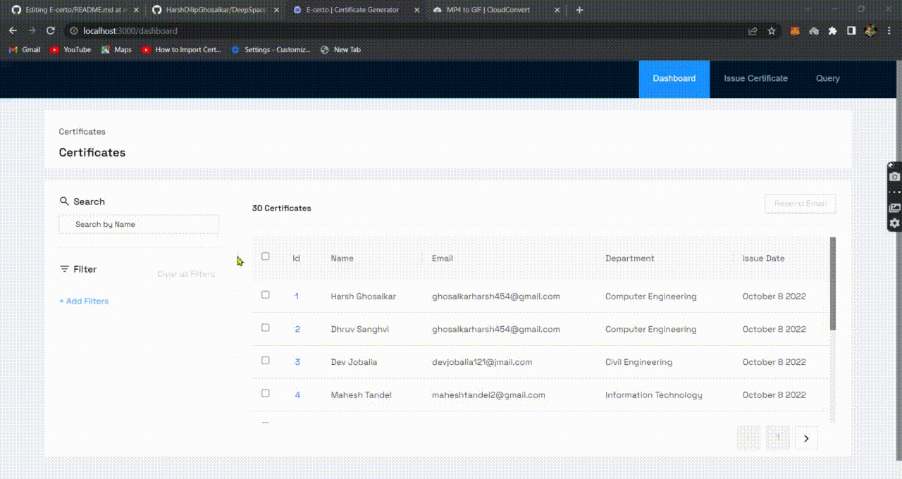
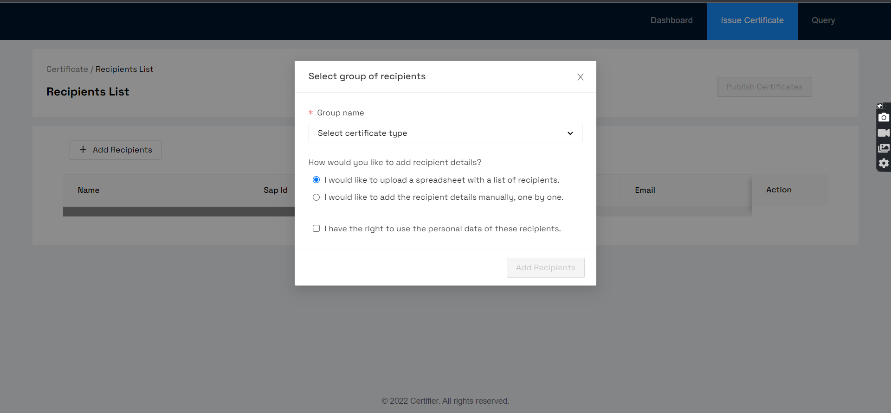
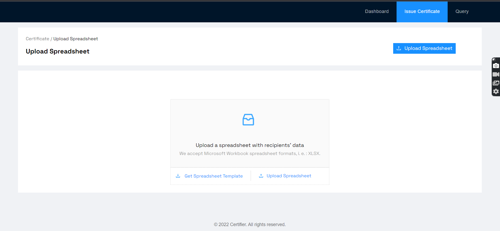
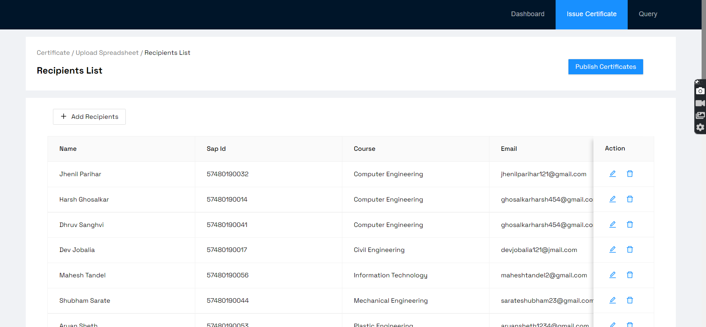

<p align="center">
 
         
        </p>
<h1 align="center"> E-Certo </h1>
<h3 align="center"> Issueing and Verifyinf Digitalizeed certificates using Blockchain<h3>

<div align="center">
  
 
  [](https://github.com/facebook/create-react-app)
   [](https://www.ethereum.org/)
    
  
   
<!--   
   -->
 </div>
  
  ## E-certo : About
- It is a blockchain based project for issueing verifying Certificates. 
- It works on the idea that: “Admin can issue,resend,download Certificates and any non user can verify the certificate using QR code” The entire process       works on the blockchain . 
- Thus this is a modern way to create Certificates and overcomes the drawback of traditional approach of verifying which consumes alot of time.

  
## Insight
- It is D-App on [Ethereum](https://www.ethereum.org/).
- Back-End has Smart Contract 
- Front-end of our Web-App is made with [React.Js](https://github.com/facebook/create-react-app)   

- We are using [Metamask](https://metamask.io/) Browser Extension to work with Ethereum.
- We have used [Truffle](https://www.trufflesuite.com/) for testing our project
  
  
  
  ## How to Use

### Signup/Login
- Connect to metamask
  <p align="center">
 
</p>
  
  
 Upon SignIn the first page that's going to be visible is the Dashboard page.
 ### Dashboard Page
- All the Certificates issueyed by the Admin will be listed on the dashboard.
- Admin can resend certificate to the user by selecting records.
- Admin can apply multiple filters such as filter by Department,Passout year,SAP.
- Admin can search the record by name.
 <p align="center">
 
</p>  
 
  ### Issue Certificate Page
- A pop up will appear asking about the type of Certificate and mode it want to submit the data like using spread sheet of manual data entry.
- After selecting spread sheet option a page will appear over there you can upload your spread sheet and can also download the template.
- After uploading the spread sheet data from excel file will be read and will be rendered to Admin to re assure whether all the data is correct or not.
- Admin can edit or delete the data.
 <p align="center">
 
  </p> 
  <p align="center">
 
 </p> 
  <p align="center">
 
</p> 
 
 ### Certificate Details Page
- By clicking on id a Certificate will be displayed.
- Admin can download the Certificate in pdf, image form also he/she can download the QR code
- Admin can also share the certificate on various social media platforms mentioned.
- Admin can also scan the QR code n verify it.
 <p align="center">
 
  </p> 

 ### Certificate Verification
- Ceriticate can be verified by scanning the QR code on it.
- After scanning the QR code it will be drived to a page where all the details of that student will be displayed and it will be a proof of being a verified document.
 <p align="center">
 
  </p> 
  


#
### Stack
- [Solidity](https://docs.soliditylang.org/en/v0.7.6/) - Object-oriented, high-level language for implementing smart contracts.
- [Bootstrap 4](https://getbootstrap.com/) - CSS framework for faster and easier web development.
- [React.js](https://reactjs.org/) - JavaScript library for building user interfaces.
- [web3.js](https://web3js.readthedocs.io/en/v1.3.4/) - Allows users to interact with a local or remote ethereum node using HTTP, IPC or WebSocket.
- [Truffle](https://www.trufflesuite.com/truffle) - Development environment, testing framework and asset pipeline for blockchains using the Ethereum Virtual Machine (EVM).
- [Ganache](https://www.trufflesuite.com/ganache) - Personal blockchain for Ethereum development used to deploy contracts, develop DApps, and run tests.
#
### Interact with the deployed DApp
- Marketplace DApp requires [Metamask](https://metamask.io/) browser wallet extension to interact with.
- Connect metamask browser wallet to Localhost 7545 running a custom RPC like Ganache.
<!-- - Access Marketplace DApp at [NFT-marketplace]() and start minting your NFTs. -->
#
### Run the DApp Locally
#### Install truffle
```
npm install -g truffle
```
#### Install ganache-cli
```
npm i ganache-cli
```
#### Run ganache-cli
```
ganache-cli --port 7545
```
#### Open new terminal window and clone this repository
```
git clone https://github.com/HarshDilipGhosalkar/DeepSpace.git
```
#### Install dependencies
```
cd DeepSpace
npm install
```
#### Compile smart contract
```
truffle compile
```
#### Deploy smart contract to ganache
```
truffle migrate
```
#### Test smart contract
```
truffle test
```
#### Start DApp
```
npm start
```
- Open metamask browser wallet and connect network to Localhost 7545.
- Import accounts from ganache-cli into the metamask browser wallet to make transactions on the DApp.
  -------------------------------------
  ## Contributing
  - We're are open to enhancements & bug-fixes.
  - Feel free to add issues and submit patches.
  ## Authors
  - Harsh Ghosalkar - [HarshDilipGhosalkar](https://github.com/HarshDilipGhosalkar)
  - Jhenil Parihar - [JhenilParihar](https://github.com/jhenilparihar)
  - Dev Jobalia -[DevJobalia](https://github.com/DevJobalia)
## License
This project is licensed under the MIT
